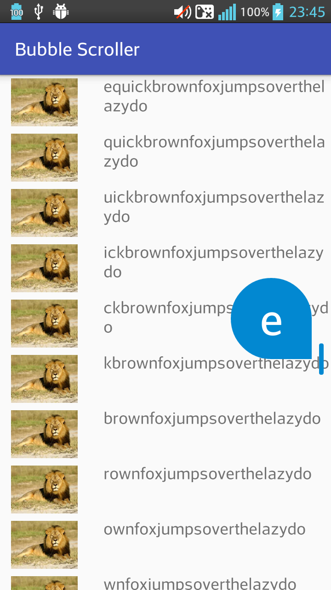

# BubbleScroller
A layout with `RecyclerView` and fast alphabet scroller



# Getting started

In your `build.gradle`:
```gradle
dependencies {
    compile project(':bubble-scroller-lib')
}
```

In your layout:
```xml
    <com.quybro.bubble_scroller_lib.BubbleRecyclerView
        android:id="@+id/bubble_recyclerView"
        android:layout_width="match_parent"
        android:layout_height="match_parent"/>
```

In your `MainActivity`:
```java
public class MainActivity extends AppCompatActivity {
    private BubbleRecyclerView mBubbleRecyclerView;

    @Override
    protected void onCreate(Bundle savedInstanceState) {
        super.onCreate(savedInstanceState);
        setContentView(R.layout.activity_main);

        mBubbleRecyclerView = (BubbleRecyclerView) findViewById(R.id.bubble_recyclerView);
        setupBubbleRecyclerView();
    }

    private void setupBubbleRecyclerView(){
        LinearLayoutManager layoutManager = new LinearLayoutManager(this);
        mBubbleRecyclerView.setLayoutManager(layoutManager);
        mBubbleRecyclerView.setAdapter(new BubbleAdapter());
    }
}
```

In your `BubbleAdapter`
You must extends class `BubbleScrollerAdapter<VH extends RecyclerView.ViewHolder>` like this
```java
public class BubbleAdapter extends BubbleScrollerAdapter<BubbleAdapter.ItemHolder>{
// your implementation here
}
```
and implements function 
```java
public String getText(int pos){
// your implementation here
}
```


Copyright 2016 Quybro

Licensed under the Apache License, Version 2.0 (the "License");
you may not use this file except in compliance with the License.
You may obtain a copy of the License at

   http://www.apache.org/licenses/LICENSE-2.0

Unless required by applicable law or agreed to in writing, software
distributed under the License is distributed on an "AS IS" BASIS,
WITHOUT WARRANTIES OR CONDITIONS OF ANY KIND, either express or implied.
See the License for the specific language governing permissions and
limitations under the License.
